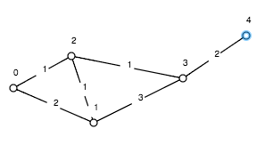
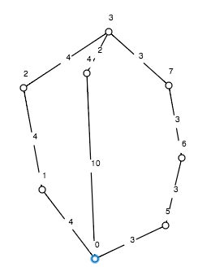

#Jednoznačnost
##O programu
Program pro zadaný graf a jeho vrchol vypíše, k jakým vrcholům je nejkratší cesta ze zadaného vrcholu jednoznačná.

Je naprogramovaný v jazyku C v XCode 4.2.
##Jak se používá
###Vstup
Program po spuštění očekává vstup v tomto formátu:
```
<pocet vrcholu grafu>
<pocet hran grafu>
<x> <y> <vaha hrany (x,y)>
(…)
<s>
```
Kde s je vrchol, od kterého se hledá cesta k ostatním.
Váhy hran jsou kladné a celočíselné.
###Výstup
Program vypíše několik řádků ve formátu:
```
<číslo vrcholu>: <x>
```
Kde **x** je **1**, pokud je nejkratší cesta k němu jednoznačná, jinak je to **0**.
##Ukázkový vstup 1
```
5
6
0 1 2
0 2 1
1 2 1
1 3 3
2 3 1
3 4 2
0
```
To odpovídá cestám z vrcholu **0** v grafu:


##Ukázkový výstup 1
```
0: 1
1: 0
2: 1
3: 1
4: 1
```
##Ukázkový vstup 2
```
8
9
0 1 4
1 2 4
2 3 4
0 4 10
4 3 2
0 5 3
5 6 3
6 7 3
7 3 3
0
```
To odpovídá cestám z vrcholu **0** v grafu:


##Ukázkový výstup 2
```
0: 1
1: 1
2: 1
3: 0
4: 1
5: 1
6: 1
7: 1
```
