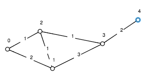

#Nejkratší cyklus
##O programu
Program v grafu najde nejkratší cyklus, který obsahuje zadanou hranu.

Je naprogramovaný v jazyku C v XCode 4.2.
##Jak se používá
###Vstup
Program po spuštění očekává vstup v tomto formátu:
```
<pocet vrcholu grafu>
<pocet hran grafu>
<x> <y> <vaha hrany (x,y)>
(…)
<v1> <v2>
```
Kde **v1** **v2** jsou vrcholy hrany, která má ležet v cyklu.
###Výstup
Program vypíše řádek ve formátu:
```
Nejkratsí cyklus obsahujici hranu <hrana> je <vrcholy cyklu>. Jeho delka je <delka>.
```
Případně, pokud hrana neleží na cyklu, program vypíše:
```
Zadana hrana neni na zadnem cyklu.
Program předpokládá správně zadaný vstup a tedy neřeší případ, kdy zadaná hrana není hranou grafu.
```
##Ukázkový vstup 1
```
5
6
0 1 2
0 2 1
1 2 1
1 3 3
2 3 1
3 4 2
1 2
```
To odpovídá grafu:


##Ukázkový výstup 1
```
Nejkratsí cyklus obsahujici hranu (1,2) je 1-0-2. Jeho delka je 3.
```
##Ukázkový vstup 2
```
5
6
0 1 2
0 2 1
1 2 1
1 3 3
2 3 1
3 4 2
3 4
```
To odpovídá stejnému grafu, ale hraně **(3,4)**.
##Ukázkový výstup2
```
Zadana hrana neni na zadnem cyklu.
```
