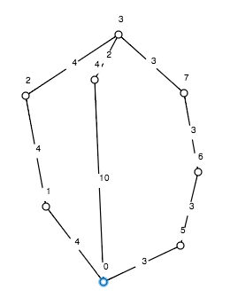

#Nejkratší mezi nejkratšími
##O programu
Program najde nejkratší cestu v grafu ze zadaného vrcholu ke všem vrcholům. Pokud jich je víc, vrátí tu, která používá nejméně hran. Používá na to Dijstrův algoritmus.
##Jak se používá
###Vstup
Program po spuštění očekává vstup v tomto formátu:
```
<pocet vrcholu grafu>
<pocet hran grafu>
<x> <y> <vaha hrany (x,y)>
(…)
<s>
```
Kde s je vrchol, od kterého se hledá cesta k ostatním
###Výstup
Program vypíše několik řádků ve formátu:
```
<číslo vrcholu>: Nejkratsi cesta je <vrcholy cesty>. Ma delku <délka> a obsahuje <počet hran> hran.
```
Kde cesta odpovídá nejkratší cestě z **s** (to je zadaný vrchol) do **číslo vrcholu**. Případně, pokud taková cesta neexistuje, může mít řádek formát:
```
<číslo vrcholu>: Cesta k tomuto vrcholu neexistuje.
```

##Ukazkovy vstup
```
8
9
0 1 4
1 2 4
2 3 4
0 4 10
4 3 2
0 5 3
5 6 3
6 7 3
7 3 3
0
```
To odpovídá cestám z vrcholu **0** v grafu:


##Ukazkovy vystup
```
0: Nejkratsi cesta je 0. Ma delku 0 a obsahuje 0 hran.
1: Nejkratsi cesta je 0-1. Ma delku 4 a obsahuje 1 hran.
2: Nejkratsi cesta je 0-1-2. Ma delku 8 a obsahuje 2 hran.
3: Nejkratsi cesta je 0-4-3. Ma delku 12 a obsahuje 2 hran.
4: Nejkratsi cesta je 0-4. Ma delku 10 a obsahuje 1 hran.
5: Nejkratsi cesta je 0-5. Ma delku 3 a obsahuje 1 hran.
6: Nejkratsi cesta je 0-5-6. Ma delku 6 a obsahuje 2 hran.
7: Nejkratsi cesta je 0-5-6-7. Ma delku 9 a obsahuje 3 hran.
```
